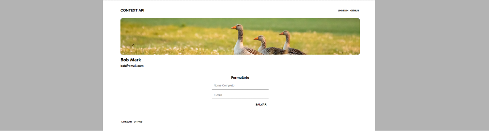
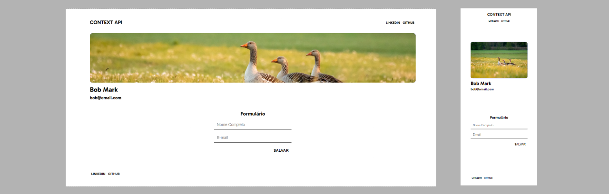

# **Context API**



## Sobre o projeto

Projeto: [trabalho de react js](https://react-context-api-pi.vercel.app/)

Site que salva o nome e o e-mail na memória através do formulário. Ao clicar em salvar, os dados são passados entre componentes, e para isso utilizo o Hook useContext do React.

Site that saves the name and email in memory through the form. When you click save, the data is passed between components, and for this I use React's useContext Hook.

## Layout web e mobile 



## Tecnologias Utilizadas

* HTML 5
* CSS 3
* Flexbox
* React
* Context API

## Ferramenta de desenvolvimento

<p float="left">
    
</p>

## Instalação do projeto

##### Instalação de dependências via terminal (Installing dependencies via terminal)
```
    npm install
```

## Execução do projeto

##### Iniciar o projeto (Start the project)
```
    npm start
```

## Autor

#### **Katarine Albuquerque**

<p float="left">
    <a href="https://www.linkedin.com/in/katarine-albuquerque/" target="_blank">
        
    </a>
    &nbsp;
    <a href="mailto:kba.2879@gmail.com" target="_blank">
        
    </a>
</p>
